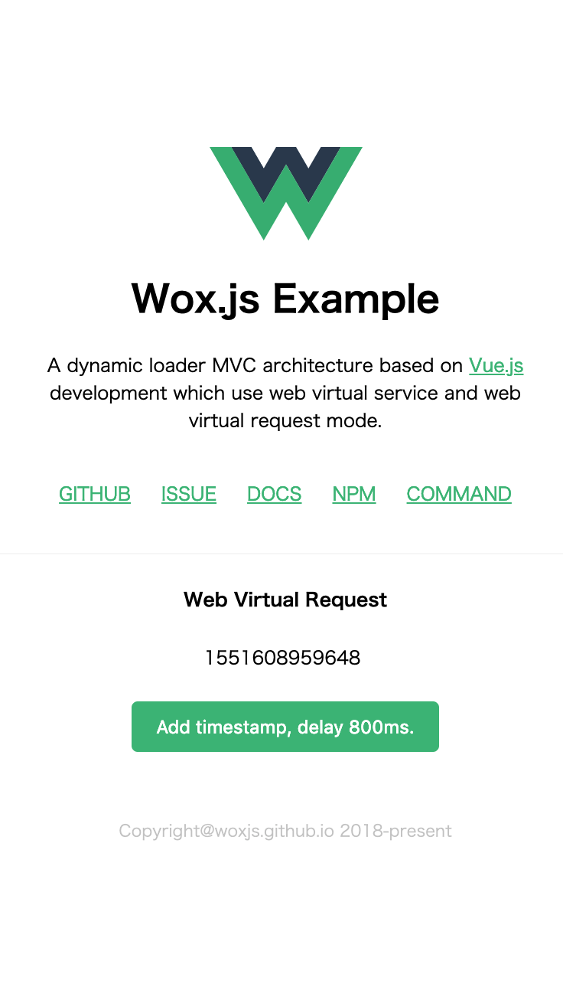

<p align="center"><a href="https://woxjs.github.io/" target="_blank" rel="noopener noreferrer"></a></p>

<p align="center">
  <a href="https://npmcharts.com/compare/@wox/wox?minimal=true"></a>
  <a href="https://www.npmjs.com/package/@wox/wox"></a>
  <a href="https://www.npmjs.com/package/@wox/wox"></a>
  <a href="https://chat.vuejs.org/"></a>
</p>

<h2 align="center">Wox.js</h2>

A dynamic loader MVC architecture based on Vue.js development which use web virtual service and web virtual request mode.

- **Virtual Service:** The virtual service system based on middleware model can decouple services between sub-services through virtual service requests, which makes the code organization and business module architecture more standardized.
- **Based on vue.js:** Use `Vue.js` as the underlying data-driven engine to make data MVVM dynamically responsive, enjoy all the features and support brought by Vue.js ecology, and quickly build the page you want.
- **Super Plugins:** Plug-ins not only aim at `UI Components`, but also provide the ability of master-slave inheritance, so that the whole project can be completed only by configuring plug-ins to achieve the effect of business module componentization.

`Wox.js` was originally designed to solve the dynamic routing problem on mobile and PC terminals. With our continuous exploration, it can carry the `empty project + multi-plug-in' mode to solve the pain point of business componentization. We constantly need to develop and balance business, so that `wox.js` can shoulder the mission of large-scale enterprise front-end application development architecture.

### Documentation

[Getting Started](https://woxjs.github.io/)

### Quick start with CLI

First you should install the official scaffolding.

```bash
$ npm i @evio/cli -g
$ cli install @wox/cli
```

Then create a new program by command.

```bash
$ cli wox:new
```

Finally start debugging development or program compilation.

```bash
$ npm run dev
$ npm run build
```

### Example

You can see the power of `wox.js` from the following code.

```javascript  
import {
  Http,
  Controller,
  Interface
} from '@wox/wox';
import IndexPage from '../webview/index.vue';
import IndexService from '../service/index';
@Controller
export default class IndexController {
  @Http.Get
  async Home() {
    const timestamp = await this.ctx.post('/timestamp');
    return <IndexPage timestamp={timestamp} />
  }
  @Http.Post('/timestamp')
  @Interface.Service('index', IndexService)
  async TimeStamp({ Service }) {
    const body = this.ctx.req.body || {};
    return await Service.index.getTime(body.delay);
  }
}
```

### preview

<p align="center"></p>

## License

[MIT](http://opensource.org/licenses/MIT)

Copyright (c) 2018-present, yunjie (Evio) shen