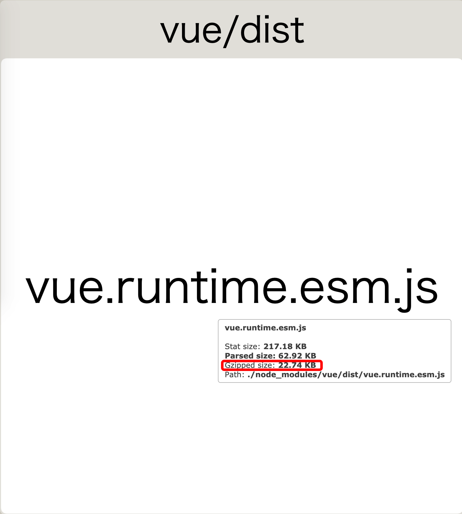

# Wox.js

A dynamic loader MVC architecture based on Vue.js development which use web virtual service and web virtual request mode.

## Document

[view docs](https://woxjs.github.io/)

## Volume comparison between wox.js and vue.js

**Vue.js**

- Parsed Size: 62.92KB
- Gzipped Size: 22.74KB

**Wox.js**

- Parsed Size: 60.07KB
- Gzipped Size: 13.11KB