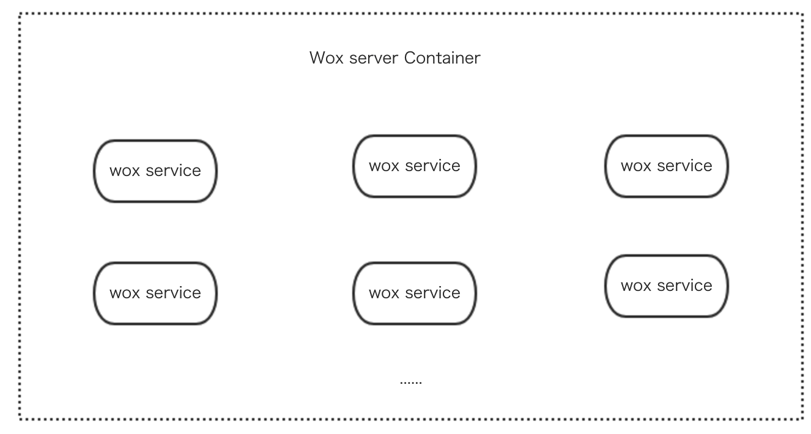

# 设计理念

Wox.js的设计理念与解决方案非常明确，就是建立一套灵活的路由服务体系，让业务开发更加解偶。

## 解偶模式

类似于微服务概念，它通过虚拟请求提供组件服务之间的数据交互，并且它具有独立而完整的路由以及内部私有数据响应。它可以是一个完整项目，也可以是一个空壳项目（通过组件提供各部分所需要的路由及数据），便于快速聚合组件形成业务项目。



每个`wox service`相当于一个插件，而`wox server`相当于一个大的启动容器，容器可以没有任何业务逻辑，仅仅做`config`配置，达到功能高度解偶到各组件中效果。

## MVC 模型

[MVC](https://baike.baidu.com/item/MVC%E6%A1%86%E6%9E%B6/9241230?fr=aladdin&fromid=85990&fromtitle=MVC) 开始是存在于桌面程序中的，M是指业务模型，V是指用户界面，C则是控制器，使用MVC的目的是将M和V的实现代码分离，从而使同一个程序可以使用不同的表现形式。比如一批统计数据可以分别用柱状图、饼图来表示。C存在的目的则是确保M和V的同步，一旦M改变，V应该同步更新。

Wox.js 采用mvc模型来管理整个请求模型，同时结合Vue.js的 [MVVM](https://baike.baidu.com/item/MVVM) 模型，使得数据驱动变得非常简便。我们采用 [KOA](https://github.com/koajs/koa) 模型来构建前端的web服务体系，解决传统前端路由的通病。

## 对比Vue-router

[Vue-router](https://router.vuejs.org/)是vue的标准路由，但它是一种静态路由，而非动态路由。

所谓静态路由，就是一个路由对应一个component组件，只要路由确定页面一定是确定的。它的优势在于能够快速确定渲染页面，性能很高。但是它的优势也成为了它的劣势。往往我们在后台系统界面中，可能会出现一个路由并非对应一个component组件页面，而是需要一些变量来决定使用哪个页面。Vue-router 无法做到。

在这里我们强补下路由概念：

- 静态路由：`Router = Component` 路由与页面一一对应，无论任意时间来观察页面，显示的内容都是一致的，表现为感官上的一致；实际运行时表现为路由与组件的一一对应。
- 动态路由：`Router = ComponentRender()` 路由根据时间或者环境的变化，会产生不一致的渲染效果，感官上表现为不同的页面；实际上路由应该对应的并非组件，而是一个选取组件的回调函数，比如`react-routerV4`中的render用法。

为了能够在PC端后台系统上可以完美解决各种路由规则以及拦截（中间件）的问题，我们摒弃了`vue-router`，因为在`Vue-router`上，我们需要写各种`hooks`才能完成我们需要的工作，大大增加了我们的开发成本。

## 真正的动态路由化

基于restful设计理念，我们将前端路由动态化，我们通过一个路由对应一个回调函数的模式让路由的选择趋于动态化。在路由改变的时候，我们都会自动选择需要渲染的页面。这就是wox.js的优势。我们选择koa做为原型是因为它是业界（nodejs）比较成熟的企业应用级MVC架构。它的成熟的理念已经被市场检验认证过。

同时，基于自身带有`Virtual Service`的理念存在，也可以自获取数据，而脱离服务端的数据返回。类似 `this.$post('/api', {}).then()` 的调用模式，以及我们在controller层对此路由的定义`@Http.Post('/api')`。

## 简介核心各层及代码演示
 
下面，将讲解如何一步一步创建MVC中的各层。

::: warning
我们建议使用工具创建我们的文件，在创建的文件基础上可自行修改。
:::

### Controller

controller层文件都是基于class的写法，同时使用注解形式标记路由规则。请看：

```javascript {6,8,10}
import { 
  Http,
  Controller,
} from '@wox/wox';

@Controller
export default class DemoController {
  @Http.Get
  async Home() {
    await this.ctx.render(webview);
  }
}
```

它主要控制路由的行为，渲染页面和返回接口数据都是通过它来完成。每个函数，可以通过直接`return data`来返回数据，也可以通过`ctx.body`来返回。建议使用`return`返回，达到controller内部函数复用的目的。

#### 注解

所谓[注解](http://web.jobbole.com/88572/)，一般可以理解为注释，在ES中的叫法为`装饰器`，在js的世界中，它具有执行意义。wox.js中注解有这么几个:

- `@Controller(prefix: string)` 标记该函数是一个controller函数，并且设置prefix前缀
- `@Middleware(...middlewares: Middleware)` 标记这个前端所使用的中间件。
- `@Http.verb(prefix: string)` 标记这个controller下有一个请求方式，同时设置path规则。
- `@Param(name: string, middleware: Middleware)` 标记这个controller的一个param拦截器。
- `@Interface.Service(name: string, service: Service)` 标记这个请求所使用到的服务对象。

#### Restful api [Virtual Request]

内部可以通过fetch方法来调用自己的逻辑。主要有以下几个方法：

- `get(url)`
- `post(url, data)`
- `put(url, data)`
- `delete(url)`

它们都返回一个`Promise`对象，表明结果数据。

```javascript {8,18}
import { 
  Http,
  Controller,
} from '@wox/wox';

@Controller
export default class DemoController {
  @Http.Get
  async welcome() {
    const res = await this.ctx.post('/test', {
      action: 'jump'
    });
    await this.ctx.render(IndexWebview, {
      text: res // abc jump
    });
  }

  @Http.Post('/test')
  async test() {
    const body = this.ctx.req.body;
    this.ctx.body = 'abc ' + body.action;
  }
}
```

### Middleware

中间件，用来拦截请求并且自定义处理。

```javascript
export default async (ctx, next) => {
  ctx.abc = 123;
  await next();
}
```
这跟我们的koa中间件写法一致。但是我们还提供了一种写法：

```javascript
export default app => {
  return async (ctx, next) => {
    ctx.abc = 123;
    await next();
  }
}
```

::: tip
由于Wox.js是基于Koa模型建立，那么部分非涉及到环境变量的Koa中间件都可以直接在前端使用。如果善用中间件模型，那么将使代码非常逻辑化和简单化。本中间件模型也支持`.param(value, ctx, next)`模式，具体参考Koa的`param`使用方式。
:::

### Service

用来处理具体业务逻辑。

```javascript
// demo.js
export default class DemoService {
  async hello() {
    return this.abc + 'def';
  }
}
```
在controller上可以这样使用

```javascript {1}
@Interface.Service('test', DemoService)
async controller({ Service }) {
  this.ctx.body = await Service.test.hello();
}
```

### Webview

即一个页面组件，写法就是vue的写法。但是通过`ctx.render`进行调用。

```javascript
import indexPage from '#/webview/index.vue';
...
async controller() {
  await this.ctx.render(indexPage);
}
```

## 总结

我们通过`Controller` `Middleware` `Service` 以及 `Webview` 将项目整体串联在一起，达到可高度复用的目的。之后介绍的插件模式，将详细讲解如何高度复用，以及高度继承。