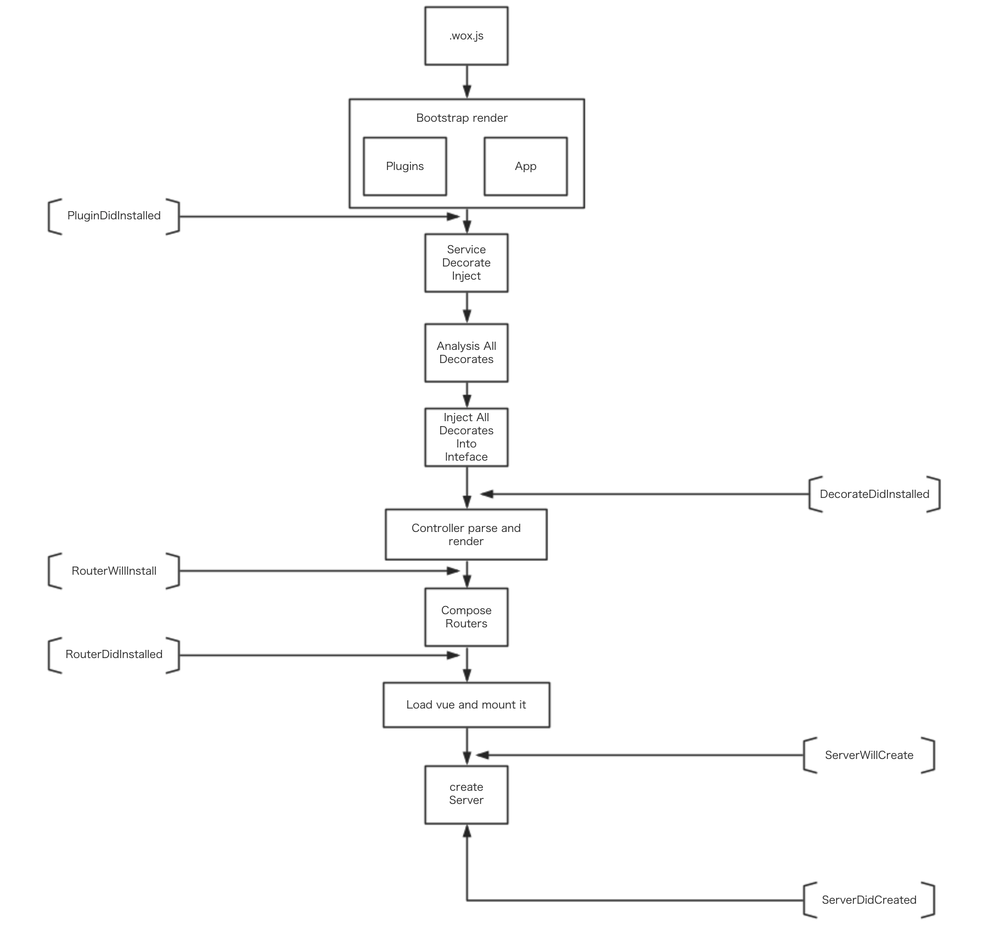

# 运行原理剖析

Wox的启动原理非常复杂，它通过`webpack`插件的`@wox/loader`来生成自动注入的`require.context`。我们尽量保障webpack的能力来驱动wox的开发。它的启动所经历的图示如下，尽量准确的告诉开发者它的启动顺序，使得开发者能够灵活利用生命周期来开发插件。



## webpack聚合文件.wox.js

`.wox.js`将会由webpack启动的时候自动创建。主要是将一些自动注入到架构中的资源对象暴露出来。它主要由以下部分组成：

### component: Array

webpack会根据`config/plugin.json`中启动的插件中固定位置的文件夹，使用`require.context`函数来加载整个文件夹的内容，形成一个数组，写入到这个变量中去，便于整个树状结构的拓扑。它也将被用于wox架构的初始化自动注入到`Vue.component`中，供全局使用。

>注意：加载的文件夹位置为每个插件(包括主项目)的 `app/vue/component`。

### directive: Array

webpack会根据`config/plugin.json`中启动的插件中固定位置的文件夹，使用`require.context`函数来加载整个文件夹的内容，形成一个数组，写入到这个变量中去，便于整个树状结构的拓扑。它也将被用于wox架构的初始化自动注入到`Vue.directive`中，供全局使用。

>注意：加载的文件夹位置为每个插件(包括主项目)的 `app/vue/directive`。

### filter: Array

webpack会根据`config/plugin.json`中启动的插件中固定位置的文件夹，使用`require.context`函数来加载整个文件夹的内容，形成一个数组，写入到这个变量中去，便于整个树状结构的拓扑。它也将被用于wox架构的初始化自动注入到`Vue.filter`中，供全局使用。

>注意：加载的文件夹位置为每个插件(包括主项目)的 `app/vue/filter`。

### mixin: Array

webpack会根据`config/plugin.json`中启动的插件中固定位置的文件夹，使用`require.context`函数来加载整个文件夹的内容，形成一个数组，写入到这个变量中去，便于整个树状结构的拓扑。它也将被用于wox架构的初始化自动注入到`Vue.mixin`中，供全局使用。

>注意：加载的文件夹位置为每个插件(包括主项目)的 `app/vue/mixin`。

### bootstrap: Array

webpack会根据`config/plugin.json`中启动的插件中的模块的根目录下的`app.js`，包括主项目下的`app.js`，通过`require`方法加载内容到一个数组，写入到这个变量中去，便于整个树状结构的拓扑。它将会在`PluginDidInstalled`的生命周期前进行初始化。它可以进行一系列的基础功能和业务功能操作，完成我们的需求。

### view: Vue

webpack会根据`config/plugin.json`中启动的插件中的模块的根目录下的`app.vue`，包括主项目下的`app.vue`，通过`require`方法不断覆盖这个变量。它是我们项目基本骨架文件，所有内部通过MVVM数据响应得到的变化的内容都会被更新到这个文件的`<WoxViewPage></WoxViewPage>`组件中去。

> 注意：`<WoxViewPage></WoxViewPage>`组件也是个全局组件，可以使用到任何地方中去，但是只允许使用一次。

### plugin_configs: object

webpack会读取主项目下的`config/plugin.${env}.json`中的内容作为所有插件的配置树，然后通过内部的逻辑分发到各自插件中去。每个插件可以通过以下代码获取到对应的配置参数

```javascript
export default (app, plugin) => {
  console.log(plugin.$config);
}
```

安装插件的时候，我们需要在插件根目录下建立一个文件`.wox.config.json`来告诉我们的cli工具，安装完毕这个插件需要将这个模板数据添加到主项目的`config/plugin.${env}.json`中去。

### custom_configs: Array

webpack会读取主项目下的`config/config.${env}.json`中的内容作为主项目的配置树，具体参考 [配置](./config.html) 一章。

### controller: Array

webpack会根据`config/plugin.json`中启动的插件中固定位置的文件夹，使用`require.context`函数来加载整个文件夹的内容，形成一个数组，写入到这个变量中去，便于整个树状结构的拓扑。它也将被用于wox架构的初始化自动注入路由到系统架构中。

>注意：加载的文件夹位置为每个插件(包括主项目)的 `app/controller`。

### decorate: Array

webpack会根据`config/plugin.json`中启动的插件中固定位置的文件夹，使用`require.context`函数来加载整个文件夹的内容，形成一个数组，写入到这个变量中去，便于整个树状结构的拓扑。它也将被用于wox架构的初始化自动生成Decorate到`Interface`对象中去，在开发的时候可以通过`@Interface.xxx`来使用这个decorate。

>注意：加载的文件夹位置为每个插件(包括主项目)的 `app/decorate`。


## Bootstrap render

系统通过`.wox.json`中的`bootstrap`参数数组，自动循环执行各个函数，用于安装插件初始化或者对项目的初始化行为。一般的，我们可以通过定义整个系统的生命周期来扩展功能。

```javascript
export default (app, plugin) => {
  console.log(plugin.$config);
  app.on('RouterDidInstalled', async () => {
    console.log('router has been installed');
  })
}
```

## Service Decorate Inject

注入关于架构中`Service`层的注解功能。

## Analysis All Decorates

系统将所有注解树实例化，绑定到内部对象中，供之后的调用。我们称这个树为注解实例树。

## Inject Decorates Into Inteface

系统将注解实例树各个对象生成对应的注解到`Interface`中，使得开发时候可以使用这些注解。

> 注解注入函数为`interfaceWillInject`，完全可以自定义内容。

## Controller parse and render

系统通过`Controller`树进行遍历，结合一定的规则逻辑生成不同的`new Router()`对象，将内容全部绑定。

> 运行过程中，注解将通过`interfaceDidRendered`方法进行内容拾取，注入到信的处理函数中。

## Compose Routers

系统通过`use(router.routes())`方法绑定到顶层路由去，这样启动服务后就可以进行内容处理。

## Load vue and mount it

将Vue实例化绑定到配置节点上，同时Mount挂在到页面上。

## Create Server

服务启动。如果服务启动过程失败，系统将自动销毁服务。如果启动成功，且启动路由不是`/`，那么系统将会replace一次页面地址。